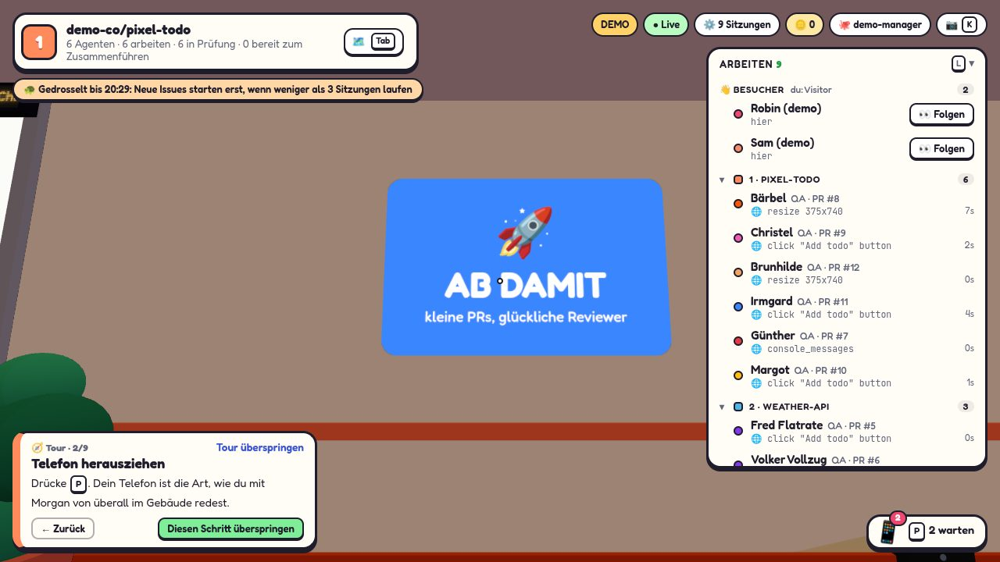
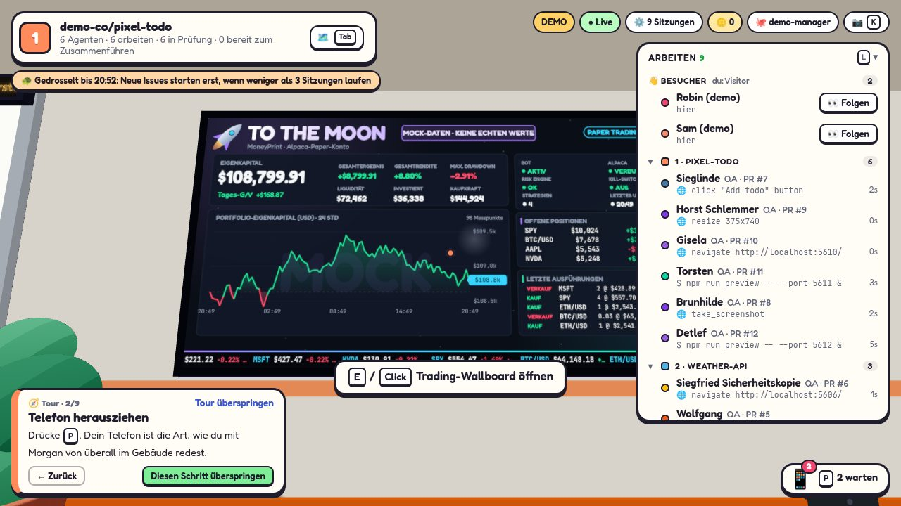
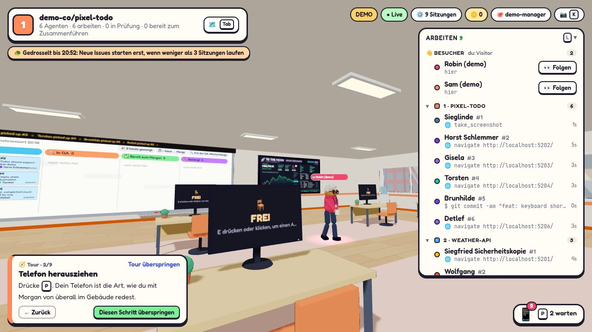
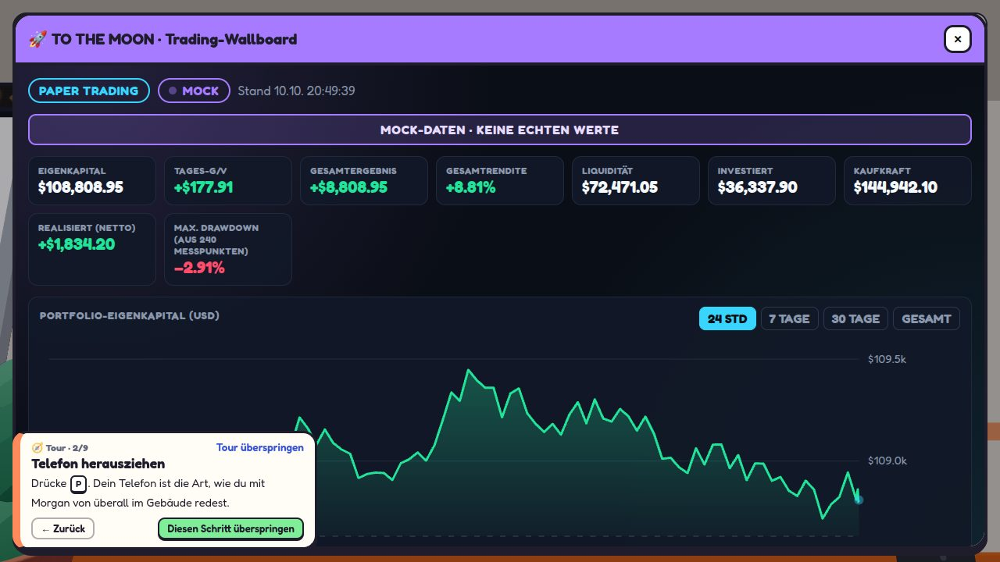

# Trading-Wallboard „TO THE MOON“

Auf der Trading-Etage (Standard: Etage 1) ersetzt ein großes Wanddisplay das blaue „AB DAMIT“-Raketenschild rechts
neben dem GitHub-Whiteboard. Es zeigt das **Alpaca-Paper-Konto** von MoneyPrint: Eigenkapital-Chart, Kennzahlen,
offene Positionen, die letzten Ausführungen (Fills), den Bot-Status und einen Kursticker. `E` (oder ein Klick in den
Kameraansichten) öffnet dieselben Daten vergrößert im Panel. Alles ist **nur lesend**.

| Vorher | Nachher (Demo, Mock-Daten) |
| --- | --- |
|  |  |
|  |  |

## Architektur

```
MoneyPrint (read-only HTTP, 127.0.0.1)
   │  GET alle 7 s (5–60 s), Timeout 4 s, Backoff bis 60 s
   ▼
CubeFarm-Server: server/trading.ts  ──  tradingSource.ts (Parser), tradingMock.ts (Mock)
   │  ein Abruf für alle Tabs, Ergebnis im Speicher; Verlauf in <SWARM_HOME>/trading-history.json
   ▼  /ws: Snapshot-Feld `trading` + Event `trading` (Verlauf nur bei Änderung)
Client-Store (store.ts) ──► TradingWall.tsx (3D, Canvas-Textur)  /  TradingPanel.tsx (HTML/SVG)
```

- **Kein Browser spricht mit MoneyPrint oder einem Broker.** Der Server liest, cached und verteilt über den
  bestehenden Websocket, wie beim Wetter (`server/weather.ts`). Es gibt keine neue REST-Route und keinen neuen Dienst.
- **3D-Ansatz:** eine Canvas-Textur über die vorhandene Paint-Pipeline (`useCanvasTexture`, OffscreenCanvas-Worker),
  wie Whiteboard und App-Monitor. Neu gezeichnet wird nur bei geänderten Daten, geändertem Zustand oder neuer Minute,
  nicht pro Frame. Bewegt sind nur billige Dinge: der Ticker verschiebt seine Textur, LED und letzter Chartpunkt
  pulsieren, bei einem neuen Hoch fliegt eine kleine Rakete. Mit „Reduzierte Bewegung“ steht alles still.
- **Platz:** `TRADING_WALL` in `client/src/world/layout.ts`: 4,3 × 2,14 m, Mitte x 9,8 / y 2,2 an der Nordwand, zwischen
  Whiteboard-Pflanze (x 7,1) und Deko-Slot `w-north-e` (ab x 12,2), unter der Lichterketten-Linie (3,5 m). Andere Etagen
  behalten das Raketenschild.

## Zustände

| Zustand | Bedeutung | Anzeige |
| --- | --- | --- |
| `live` | letzter Abruf erfolgreich und jünger als 30 s | grüne LED, „LIVE“ |
| `stale` | MoneyPrint antwortet nicht mehr oder letzter Erfolg > 30 s | „VERALTET“, Fehlertext, Status ausgegraut, letzte Werte bleiben stehen |
| `offline` | noch nie erfolgreich gelesen | „OFFLINE“, alle Werte „n/v“ |
| `mock` | keine MoneyPrint-URL konfiguriert (oder Demo) | „MOCK“, Banner „MOCK-DATEN · KEINE ECHTEN WERTE“, Wasserzeichen |

Fehlende Felder erscheinen immer als „n/v“, nie als 0. Echte und Mock-Daten werden nie gemischt.
`PAPER TRADING` steht immer im Kopf; meldet eine Quelle `trading_mode: "live"`, zeigt die Wand stattdessen eine rote
Warnung. Die heutige `/status.json` meldet den Modus nicht; dann steht „Modus nicht gemeldet“ daneben.

## Konfiguration (Umgebung des CubeFarm-Servers)

| Variable | Standard | Zweck |
| --- | --- | --- |
| `MONEYPRINT_WALLBOARD_URL` | – (Mock) | z. B. `http://127.0.0.1:8765/status.json`; nur `http`/`https`, keine Zugangsdaten in der URL |
| `MONEYPRINT_WALLBOARD_TOKEN` | – | optional, wird nur serverseitig als `Authorization: Bearer …` an MoneyPrint gesendet |
| `CUBEFARM_TRADING_FLOOR` | `1` | Etage mit dem Wallboard |
| `CUBEFARM_TRADING_POLL_MS` | `7000` | Abrufintervall, begrenzt auf 5000–60000 |

## Datenvertrag `cubefarm.trading/v1` (shared/trading.ts)

Zeitstempel in Epoch-Millisekunden, fehlende Werte `null`.

- `account`: `equity`, `cash`, `buying_power`, `day_pnl`, `total_pnl`, `total_return_pct`, `invested`, `realized_pnl`
- `history`: je Zeitraum `24h` / `7d` / `30d` / `all` höchstens 240 **gemessene** Punkte `{ timestamp, equity, source }`;
  ausgedünnt wird durch Auswahl echter Punkte, nie durch Mittelwerte. Lücken > 6 typische Schritte (min. 30 min)
  unterbrechen die Linie.
- `positions[]`: `symbol`, `quantity`, `market_value`, `notional`, `avg_entry_price`, `current_price`, `unrealized_pnl`, `unrealized_pnl_pct`
- `recent_fills[]` (max. 10, neueste zuerst): `order_id`, `symbol`, `side`, `quantity`, `fill_price`, `filled_at`, `strategy_id`.
  Nur ausgeführte Orders mit vollständigem Fill; Signale, offene, akzeptierte oder abgelehnte Orders nie.
- `market_quotes[]`: `symbol`, `price`, `change_pct`, `timestamp`, `feed`
- `system`: `trading_mode`, `broker_connection`, `bot_status`, `risk_status`, `kill_switch`, `active_strategies`, `last_successful_update`
- Meta: `schema`, `source` (`moneyprint` | `mock` | `none`), `state`, `floor`, `fetchedAt`, `error`, `missing[]`

Max. Drawdown wird im Client aus `history.all` berechnet (nur ab 2 Punkten, mit Angabe der Punktzahl).

## MoneyPrint-Anbindung heute

MoneyPrint bietet bereits `moneyprint dashboard --port 8765` (`monitoring/dashboard.py`): ein nur lesender HTTP-Server
auf 127.0.0.1 mit `GET /status.json`. CubeFarm versteht dieses Format direkt. Daraus kommen heute:

| Wallboard | Quelle in `/status.json` |
| --- | --- |
| Eigenkapital, Liquidität, Investiert, Realisiert | `report.equity`, `report.cash`, `report.open_position_market_value`, `report.pnl_net` (Tagesbericht) |
| Positionen | `positions[].symbol`, `positions[].notional` |
| Fills | `orders[]` mit `status == "executed"` und Fill mit `symbol`, `side`, `quantity`, `price` |
| Kill-Switch, Risk Engine, Bot | `controls.*` und `heartbeat.at` (Heartbeat älter als 5 min ⇒ FEHLER) |
| Eigenkapitalverlauf | von CubeFarm gesampelt: `report.equity` beim Abruf (bei Änderung max. 1/min, sonst alle 10 min) |

**Fehlende Felder** (werden als „n/v“ angezeigt und in `missing` gemeldet): `account.buying_power`, `account.day_pnl`,
`account.total_pnl`, `account.total_return_pct`, `equity_history` (Broker-Portfoliohistorie), `positions.quantity`,
`positions.market_value`, `positions.avg_entry_price`, `positions.current_price`, `positions.unrealized_pnl`,
`positions.unrealized_pnl_pct`, `recent_fills.filled_at` (liegt als `orders.executed_at` in der Audit-DB, wird aber
nicht ausgegeben), `recent_fills.strategy_id` (liegt in `orders.intent`), `market_quotes`, `system.trading_mode`,
`system.broker_connection`, `system.active_strategies`.

Außerdem läuft `moneyprint dashboard` auf dem Server noch nicht als Dienst (es gibt nur `moneyprint-trader`,
`-deploy`, `-disclosures`).

## Upstream-Vertrag `moneyprint.wallboard/v1` (Ziel für MoneyPrint)

Liefert MoneyPrint eine Antwort mit `"schema": "moneyprint.wallboard/v1"`, liest CubeFarm sie vollständig, ohne
eigenes Sampling. ISO-8601-Zeitstempel; unbekannte Werte `null`.

```json
{
  "schema": "moneyprint.wallboard/v1",
  "generated_at": "2026-10-10T12:00:00Z",
  "account": { "equity": 0, "cash": 0, "buying_power": 0, "day_pnl": 0, "total_pnl": 0, "total_return_pct": 0, "long_market_value": 0, "realized_pnl": 0 },
  "equity_history": [{ "timestamp": "…", "equity": 0, "source": "alpaca.portfolio_history" }],
  "positions": [{ "symbol": "NVDA", "quantity": 0, "market_value": 0, "avg_entry_price": 0, "current_price": 0, "unrealized_pnl": 0, "unrealized_pnl_pct": 0 }],
  "recent_fills": [{ "order_id": "…", "symbol": "NVDA", "side": "buy", "quantity": 0, "fill_price": 0, "filled_at": "…", "strategy_id": "…" }],
  "market_quotes": [{ "symbol": "BTC/USD", "price": 0, "change_pct": 0, "timestamp": "…", "feed": "iex|crypto" }],
  "system": { "trading_mode": "paper", "broker_connection": "connected", "bot_status": "active|paused|halted|error", "risk_status": "ok|paused", "kill_switch": "on|off", "active_strategies": 0, "last_successful_update": "…" }
}
```

### Entwurf für das MoneyPrint-Issue

> **Read-only Wallboard-Endpunkt für CubeFarm (`moneyprint.wallboard/v1`)**
>
> CubeFarm zeigt das Paper-Konto auf einem Wallboard und liest dafür `GET /status.json` von `moneyprint dashboard`.
> Bitte einen zusätzlichen, nur lesenden Endpunkt `GET /wallboard.json` im bestehenden `monitoring/dashboard.py`
> ergänzen, der das Schema oben liefert. Keine Änderung an Strategie-, Risiko-, Gateway- oder Brokerlogik.
>
> - Konto: `buying_power`, `long_market_value`, `day_pnl` (equity − last_equity), `total_pnl`/`total_return_pct`
>   (gegen ein festes Startkapital) aus dem Alpaca-Paper-Kontodatensatz, gecacht (z. B. 30 s), nur lesend.
> - `equity_history`: Alpaca Portfolio History (1D/1W/1M/all), gecacht.
> - Positionen mit `quantity`, `market_value`, `avg_entry_price`, `current_price`, `unrealized_pl(pc)`.
> - Fills aus der Audit-DB mit `executed_at` und `strategy_id` (aus `orders.intent`), nur `status = 'executed'`.
> - `market_quotes` für BTC/USD, ETH/USD, AAPL, MSFT, NVDA, SPY über den vorhandenen Market-Data-Provider, mit Feed
>   und Zeitstempel.
> - `system`: `trading_mode: "paper"` (fest), `broker_connection`, `active_strategies`, `last_successful_update`.
> - Weiterhin nur `127.0.0.1`; optional Bearer-Token aus einer Datei außerhalb des Repos.
> - Optional: systemd-Unit `moneyprint-dashboard.service` (User `moneyprint`, gleiche Härtung wie der Trader).

## Deployment

1. MoneyPrint-Dashboard auf dem MoneyPrint-Server starten lassen (nur lesend, bindet an 127.0.0.1):
   `moneyprint dashboard --port 8765` – am besten als eigener systemd-Dienst; **nicht** im Trader-Dienst und ohne
   Änderung an `/opt/moneyprint/current`.
2. Läuft CubeFarm auf einem anderen Rechner: SSH-Tunnel statt offenem Port, z. B.
   `ssh -N -L 8765:127.0.0.1:8765 <moneyprint-server>`.
3. CubeFarm mit `MONEYPRINT_WALLBOARD_URL=http://127.0.0.1:8765/status.json` starten (später `/wallboard.json`).
   Der CubeFarm-Server selbst lauscht weiterhin nur auf 127.0.0.1.

## Sicherheit

- Nur `GET` mit `accept`-Header (+ optional Bearer); kein Body, keine Schreibmethode (`server/trading.test.ts` prüft das).
- Token und URL gehen nie an Tabs, Logs oder das Zeitraffer-Journal (das `trading` nicht aufzeichnet).
- Keine Broker-Endpunkte, keine Alpaca-/eToro-Secrets im Code; das Wallboard kann MoneyPrint weder stoppen noch starten.
- Antworten > 2 MB oder in unbekanntem Format werden verworfen; Fehlertexte nennen keine Hosts.
